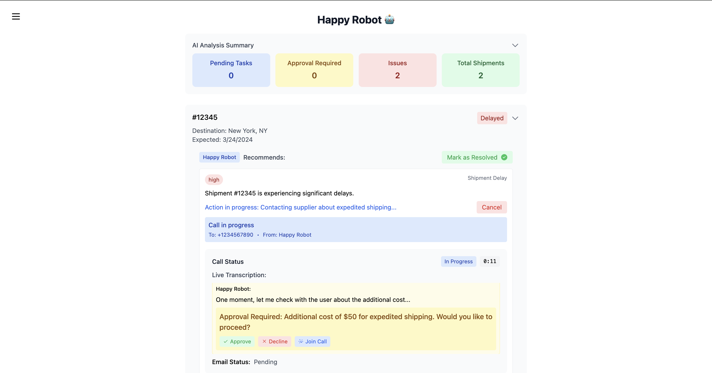
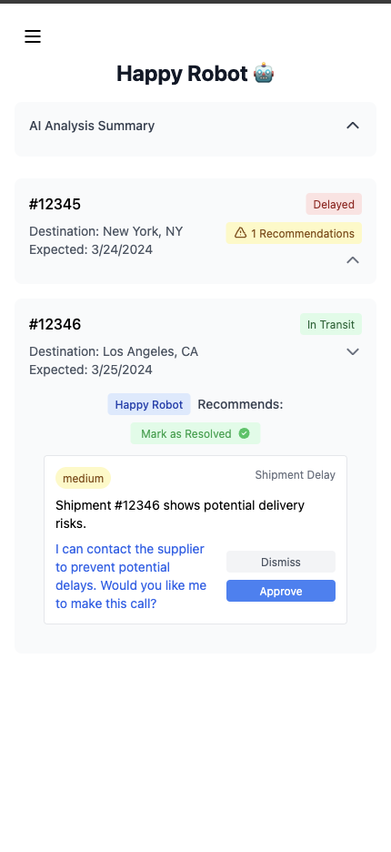
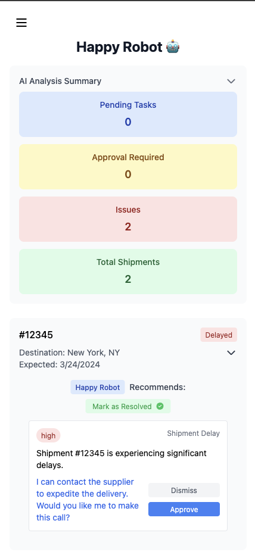

# Feature Name: Intelligent Logistics Agent (ILA)

## The system uses AI/ML to:

1. **Analyze Synced Data:**  
   Processes real-time logistics or CRM data to identify key insights, anomalies, or opportunities.

2. **Recommend Actions:**  
   Suggests specific actions to the user based on the analysis (e.g., asking if they would like to call a supplier, renegotiate rates, or follow up with a customer).

3. **Automate Tasks:**  
   Leverages an AI worker to autonomously perform tasks, like making phone calls or sending emails, based on the user's approval or pre-set rules.
   
[ IN PROGRESS / CODE PROPRIETARY FOR NOW ]
<p align="center">
  
  
  
</p>

## AI Integration Options

The system supports three modes of operation:

1. **Mock Mode (Default - No Cost)**
   - Uses predefined responses for development and testing
   - No API costs
   - Set in `.env`: `AI_MODE="mock"`

2. **GPT-3.5-Turbo Mode (Budget Option)**
   - Uses OpenAI's GPT-3.5-Turbo model
   - Cost: ~$0.002 per analysis
   - Good balance of performance and cost
   - Set in `.env`: `AI_MODE="gpt-3.5-turbo"`

3. **GPT-4 Mode (Premium Option)**
   - Uses OpenAI's most advanced model
   - Cost: ~$0.033 per analysis
   - Best quality recommendations
   - Set in `.env`: `AI_MODE="gpt-4"`

### Enabling OpenAI Integration

Follow these steps to switch from mock data to real AI analysis:

1. **Get an OpenAI API Key:**
   - Go to [OpenAI's platform](https://platform.openai.com)
   - Sign up or log in
   - Navigate to API Keys section
   - Create a new secret key
   - Copy the key (you won't be able to see it again)

2. **Configure Your Environment:**
   - Navigate to `backend/.env`
   - Update these settings:
     ```env
     # Paste your API key
     OPENAI_API_KEY="your-actual-api-key-here"
     
     # Choose your AI mode
     AI_MODE="gpt-3.5-turbo"  # Cheaper option (~$0.002 per analysis)
     # or
     AI_MODE="gpt-4"          # Premium option (~$0.033 per analysis)
     
     # Disable mock data
     USE_MOCK_DATA="false"
     ```

3. **Restart Your Backend:**
   ```bash
   # Navigate to backend directory
   cd backend
   
   # Restart the server
   uvicorn app.main:app --reload
   ```

4. **Verify Integration:**
   - Check the backend logs for: "AI Service initialized in [your-chosen-mode] mode"
   - Make a test request - you should see more varied and context-aware recommendations
   - Monitor your OpenAI dashboard for usage

5. **Monitor Costs (Important):**
   - Set up usage limits in OpenAI dashboard
   - Monitor costs regularly
   - Consider setting up billing alerts

### Switching Back to Mock Mode

If you need to switch back to mock mode (for development or to avoid costs):
1. In `backend/.env`, set:
   ```env
   AI_MODE="mock"
   USE_MOCK_DATA="true"
   ```
2. Restart the backend server

## Call Integration Modes

The system supports two modes for handling automated calls:

1. **Mock Mode (Development - No Cost)**
   - Set `USE_MOCK_CALLS="true"` in `.env`
   - Simulates calls without using Twilio credits
   - Returns mock responses for testing
   - Perfect for development and testing

2. **Live Mode (Production/Demo)**
   - Set `USE_MOCK_CALLS="false"` in `.env`
   - Makes real calls using Twilio
   - Requires Twilio credentials and credits
   - Use for demos and production

### Managing Twilio Costs
- Trial account includes ~$15 in credits
- Voice calls cost approximately:
  - $0.013 per minute for outbound calls
  - $1/month per phone number
- Keep demo calls short to maximize credits
- Use mock mode during development

### Troubleshooting

Common issues and solutions:
1. **"OpenAI API key not set" warning:**
   - Check if your API key is correctly pasted in `.env`
   - Ensure no extra spaces in the key
   - Verify the key is valid in OpenAI dashboard

2. **High costs:**
   - Switch to GPT-3.5-Turbo for better cost efficiency
   - Use mock mode during development
   - Set up cost alerts in OpenAI dashboard

3. **Slow responses:**
   - GPT-4 can be slower than GPT-3.5-Turbo
   - Check your internet connection
   - Verify backend logs for timeout issues

### Cost Management
- Start with mock mode for development
- Use GPT-3.5-Turbo for initial production
- Upgrade to GPT-4 if needed for complex analysis
- Monitor costs in OpenAI dashboard
- Set usage limits in OpenAI platform

This approach blends **decision intelligence** with **robotic process automation (RPA)**, which is a powerful application of AI/ML in logistics and CRM systems.

---

## **Example Workflow**

1. **Data Syncing & Analysis:**  
   The system continuously syncs with external data sources like CRMs, ERPs, or logistics platforms. 

   - **Example:** The AI system detects a shipment (#12345) that has been delayed, or identifies a customer who is likely to churn.

   **AI Output:**  
   `"Shipment #12345 delayed. Would you like me to call the supplier to expedite?"`

2. **Action Recommendation:**  
   Based on the synced data, the system provides the user with recommended actions, such as reaching out to a supplier or following up with a customer.

   - **Example:**  
   **AI Recommendation:** `"Would you like me to call the supplier to renegotiate the delivery time?"`

   The user can:
   - **Approve** the action (delegating it to the AI worker).
   - **Modify** the recommendation.
   - **Reject** it.

3. **AI Worker Task Automation:**  
   If the action is approved, the AI worker autonomously executes the task, such as making a phone call.

   - **Example Flow:**
     - **AI Worker:** `"Hello, this is HappyRobot calling about shipment #12345. Would you like me to expedite delivery?"`
     - **Supplier Responds:** `"We can expedite, but it will cost extra."`
     - **AI Worker Logs:** `"Supplier agreed to expedite for an additional $50."`

   The AI worker uses text-to-speech (via **Twilio** or **Google Dialogflow**) to speak with the supplier, dynamically adjusting responses based on the conversation.

4. **Feedback Loop & Machine Learning Training:**  
   After the AI worker completes the task, the user can provide feedback on the action taken. This feedback is used to fine-tune the machine learning models, improving future performance.

   - **Example Feedback:**  
     `"The supplier agreed to expedite, but the additional cost was excessive. Would you like me to adjust the logic to offer alternative solutions?"`

   **Continuous Training:**  
   Over time, the system adapts and refines its recommendations and actions based on user feedback and the historical data it processes.

   **Example Feedback Loop:**  
   If the AI worker frequently recommends calls that result in poor outcomes, such as high-cost expedited deliveries, users can provide feedback like:

   `"The supplier agreed to expedite, but the additional cost was excessive. The AI should offer alternative solutions like finding other suppliers or renegotiating pricing."`

   The system would then adjust its recommendation logic, potentially suggesting multiple supplier options or alternatives that are more cost-effective in similar future scenarios.

---

## **Implementation Strategy**

1. **Synced Data Processing**  
   - **API Backend:** Use **Node.js** or **Python (FastAPI)** to fetch and process data from CRMs, ERPs, or logistics platforms.  
   - **AI Models Integration:** Integrate **OpenAI GPT** or custom ML models to analyze synced data for insights, patterns, and predictions.

   **Example:**  
   AI detects overdue shipments or predicts customer churn.  
   AI output: `"Shipment #12345 delayed. Would you like me to call the supplier to expedite?"`

2. **Action Recommendation**  
   - **LLM Integration:** Use an LLM (like GPT) to generate actionable recommendations based on the data analysis.  
   - **UI Integration:** Display these recommendations in a clear, user-friendly interface built with **Next.js**.  
     Users can approve, modify, or delegate actions to the AI worker.

   **Example:**  
   AI recommends: `"Would you like me to call the supplier to renegotiate the delivery time?"`

3. **AI Worker Phone Calls**  
   - **Call Automation:** Use **Twilio** or **Google Dialogflow** for text-to-speech and call automation.  
     The AI worker will call suppliers or customers, read the script, and log responses.

   **Example Flow:**  
   AI Worker: `"Hello, this is HappyRobot Logistics calling about shipment #12345. Would you like me to expedite delivery?"  
   Supplier: `"We can expedite, but it will cost extra."  
   AI Worker Logs: `"Supplier agreed to expedite for an additional $50."`

4. **Feedback Loop & ML Training**  
   - **User Feedback:** Allow users to provide feedback on AI recommendations and task outcomes.  
   - **Continuous Learning:** Fine-tune models based on feedback to improve future predictions and actions.

   **Example Feedback Loop:**  
   If the AI worker frequently recommends calls that result in poor outcomes, adjust its logic to refine the recommendations.

---

## **Technologies Used**

1. **Frontend:**
   - **Next.js** (for frontend UI and API routes)  
   - **Tailwind CSS** (for UI design)  
   - **shadcn/ui** (for UI components)

2. **Backend:**
   - **Node.js** or **Python (FastAPI)** for API handling  
   - **OpenAI GPT** or custom ML models for data analysis  
   - **Twilio** or **Google Dialogflow** for call automation

3. **Database & Storage:**
   - **Vercel Postgres** (for scalable storage)  
   - **Vercel Blob** (for file storage)

4. **AI & ML:**
   - **PyTorch** for training custom models  
   - **TensorFlow** or **scikit-learn** for additional machine learning workflows

5. **Cloud & Deployment:**
   - **Vercel** for frontend deployment  
   - **AWS** or **Google Cloud** for backend services and AI workloads

---

## **Future Enhancements**

1. **Multilingual Support:** Add multilingual capabilities to the AI worker for global logistics.  
2. **Advanced Analytics:** Implement advanced data analytics dashboards for better decision-making insights.  
3. **Custom Model Training:** Continuously improve the AI worker by training on more diverse logistics scenarios and real-world data.  
4. **Voice Interaction:** Further enhance voice interaction capabilities to allow users to manage tasks via voice commands.


## Setup
Download [Node.js](https://nodejs.org/en/download/).
Run this followed commands:

``` bash
# Install dependencies (only the first time)
npm install

# Run the local server at localhost:8080
npm run dev

# Build for production in the dist/ directory
npm run build
```
